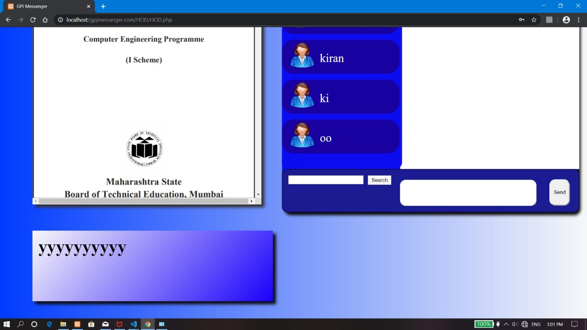

# gpjmessenger
This is my finel year (Diploma) project. in this project i implement a problem statement to make one platform to communicate all diprament stafe and publish a new circular 

This project contain 
,html
,css
,javascript
,php 

I not use (Bootstrap) whole gui make by html and css 

Login Page 
-----------------

     

home Page 
-----------------

     

Sign up Page 
-----------------

     

